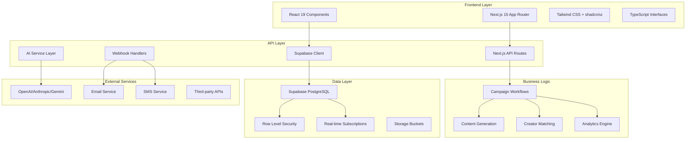
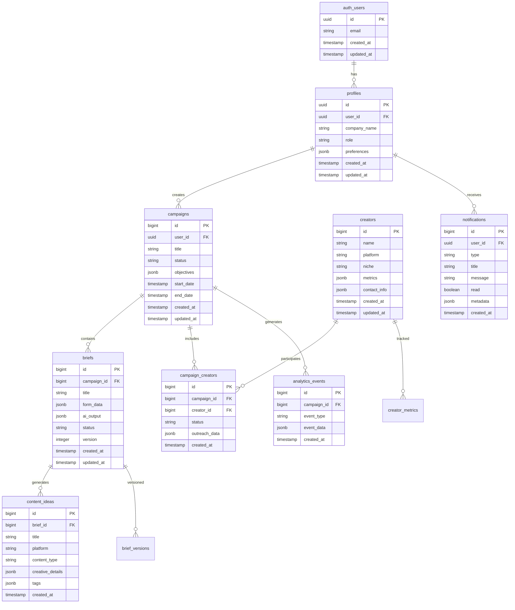
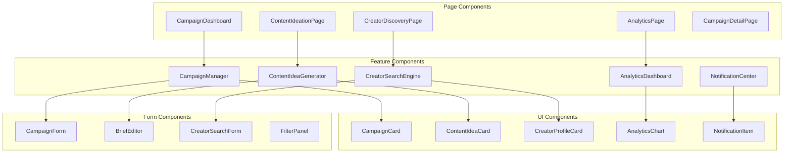

# Design Document

## Overview

This design document outlines the architecture and implementation approach for CreatorBrief AI Phase 2, which transforms the current MVP brief generator into a comprehensive creator campaign management platform. The design builds upon the existing Next.js 15 application with TypeScript, Tailwind CSS, and multi-AI provider integration, adding Supabase for data persistence, authentication, and real-time features.

The Phase 2 system introduces five core modules: AI-Powered Content Ideation, Creator Discovery Engine, Campaign Management System, Analytics Dashboard, and Notification System. Each module is designed to integrate seamlessly with the existing architecture while providing scalable, secure, and user-friendly functionality.

## Architecture

### System Architecture Overview



### Database Architecture

The system uses Supabase PostgreSQL with Row Level Security (RLS) for multi-tenant data isolation and security. The database schema supports user authentication, campaign management, content ideation, creator profiles, and analytics tracking.



### Authentication & Authorization

The system implements Supabase Auth with magic link authentication, social logins, and role-based access control. Row Level Security policies ensure users can only access their own data and campaigns they're authorized to view.

## Components and Interfaces

### Core Components Architecture



### Enhanced Type Definitions

Building on the existing `types/brief.ts`, the system adds comprehensive type definitions for all new features:

```typescript
// Campaign Management Types
export interface Campaign {
  id: number;
  user_id: string;
  title: string;
  status: 'draft' | 'active' | 'paused' | 'completed';
  objectives: CampaignObjective[];
  target_audience: string;
  budget_range: string;
  platforms: string[];
  start_date: string;
  end_date: string;
  created_at: string;
  updated_at: string;
  briefs?: Brief[];
  creators?: CampaignCreator[];
}

export interface Brief {
  id: number;
  campaign_id: number;
  title: string;
  form_data: CreatorBriefFormData;
  ai_output: CreatorBriefOutput;
  status: 'draft' | 'generated' | 'approved' | 'sent';
  version: number;
  created_at: string;
  updated_at: string;
  content_ideas?: ContentIdea[];
}

// Content Ideation Types
export interface ContentIdea {
  id: number;
  brief_id: number;
  title: string;
  platform: string;
  content_type: 'video' | 'carousel' | 'story' | 'reel' | 'post';
  hook: string;
  concept: string;
  cta: string;
  duration?: string;
  creative_details: {
    visual_style: string;
    tone: string;
    key_elements: string[];
  };
  tags: string[];
  created_at: string;
}

// Creator Discovery Types
export interface Creator {
  id: number;
  name: string;
  platform: string;
  niche: string[];
  followers_count: number;
  engagement_rate: number;
  location?: string;
  metrics: {
    avg_views: number;
    avg_likes: number;
    avg_comments: number;
    recent_performance: number[];
  };
  contact_info: {
    email?: string;
    instagram?: string;
    tiktok?: string;
    youtube?: string;
  };
  sample_content?: string[];
  created_at: string;
  updated_at: string;
}

export interface CreatorMatchScore {
  creator: Creator;
  score: number;
  reasoning: string;
  match_factors: {
    niche_alignment: number;
    audience_overlap: number;
    engagement_quality: number;
    brand_safety: number;
  };
}

// Analytics Types
export interface AnalyticsData {
  campaign_id: number;
  metrics: {
    reach: number;
    impressions: number;
    engagement_rate: number;
    click_through_rate: number;
    conversion_rate: number;
    cost_per_engagement: number;
  };
  performance_by_platform: Record<string, PlatformMetrics>;
  creator_performance: CreatorPerformance[];
  time_series_data: TimeSeriesPoint[];
}

export interface NotificationPreferences {
  email_enabled: boolean;
  sms_enabled: boolean;
  in_app_enabled: boolean;
  campaign_updates: boolean;
  creator_responses: boolean;
  performance_alerts: boolean;
  weekly_reports: boolean;
}
```

### API Interface Design

The system extends the existing API structure with new endpoints for each feature module:

```typescript
// Campaign Management API
POST /api/campaigns - Create new campaign
GET /api/campaigns - List user campaigns
GET /api/campaigns/[id] - Get campaign details
PUT /api/campaigns/[id] - Update campaign
DELETE /api/campaigns/[id] - Delete campaign

// Brief Management API
POST /api/campaigns/[id]/briefs - Create brief in campaign
GET /api/briefs/[id] - Get brief details
PUT /api/briefs/[id] - Update brief
POST /api/briefs/[id]/generate - Regenerate AI content

// Content Ideation API
POST /api/briefs/[id]/content-ideas - Generate content ideas
GET /api/content-ideas/[id] - Get content idea details
PUT /api/content-ideas/[id] - Update content idea
POST /api/content-ideas/[id]/variations - Generate variations

// Creator Discovery API
GET /api/creators/search - Search creators with filters
GET /api/creators/[id] - Get creator profile
POST /api/creators/match - AI-powered creator matching
GET /api/creators/recommendations - Get recommended creators

// Analytics API
GET /api/campaigns/[id]/analytics - Get campaign analytics
GET /api/analytics/dashboard - Get dashboard overview
POST /api/analytics/export - Export analytics report

// Notifications API
GET /api/notifications - Get user notifications
PUT /api/notifications/[id]/read - Mark notification as read
POST /api/notifications/preferences - Update notification preferences
```

## Data Models

### Supabase Database Schema

The database schema implements a multi-tenant architecture with proper relationships and constraints:

```sql
-- Enable necessary extensions
CREATE EXTENSION IF NOT EXISTS "uuid-ossp";
CREATE EXTENSION IF NOT EXISTS "pg_jsonschema";

-- Profiles table (extends auth.users)
CREATE TABLE public.profiles (
  id UUID REFERENCES auth.users(id) ON DELETE CASCADE PRIMARY KEY,
  company_name TEXT,
  role TEXT CHECK (role IN ('admin', 'manager', 'editor', 'viewer')),
  preferences JSONB DEFAULT '{}',
  notification_preferences JSONB DEFAULT '{
    "email_enabled": true,
    "sms_enabled": false,
    "in_app_enabled": true,
    "campaign_updates": true,
    "creator_responses": true,
    "performance_alerts": true,
    "weekly_reports": false
  }',
  created_at TIMESTAMPTZ DEFAULT NOW(),
  updated_at TIMESTAMPTZ DEFAULT NOW()
);

-- Campaigns table
CREATE TABLE public.campaigns (
  id BIGINT GENERATED BY DEFAULT AS IDENTITY PRIMARY KEY,
  user_id UUID REFERENCES public.profiles(id) ON DELETE CASCADE NOT NULL,
  title TEXT NOT NULL,
  status TEXT CHECK (status IN ('draft', 'active', 'paused', 'completed')) DEFAULT 'draft',
  objectives JSONB DEFAULT '[]',
  target_audience TEXT,
  budget_range TEXT,
  platforms TEXT[] DEFAULT '{}',
  start_date TIMESTAMPTZ,
  end_date TIMESTAMPTZ,
  created_at TIMESTAMPTZ DEFAULT NOW(),
  updated_at TIMESTAMPTZ DEFAULT NOW()
);

-- Briefs table
CREATE TABLE public.briefs (
  id BIGINT GENERATED BY DEFAULT AS IDENTITY PRIMARY KEY,
  campaign_id BIGINT REFERENCES public.campaigns(id) ON DELETE CASCADE NOT NULL,
  title TEXT NOT NULL,
  form_data JSONB NOT NULL,
  ai_output JSONB,
  status TEXT CHECK (status IN ('draft', 'generated', 'approved', 'sent')) DEFAULT 'draft',
  version INTEGER DEFAULT 1,
  created_at TIMESTAMPTZ DEFAULT NOW(),
  updated_at TIMESTAMPTZ DEFAULT NOW()
);

-- Content Ideas table
CREATE TABLE public.content_ideas (
  id BIGINT GENERATED BY DEFAULT AS IDENTITY PRIMARY KEY,
  brief_id BIGINT REFERENCES public.briefs(id) ON DELETE CASCADE NOT NULL,
  title TEXT NOT NULL,
  platform TEXT NOT NULL,
  content_type TEXT CHECK (content_type IN ('video', 'carousel', 'story', 'reel', 'post')) NOT NULL,
  hook TEXT,
  concept TEXT,
  cta TEXT,
  duration TEXT,
  creative_details JSONB DEFAULT '{}',
  tags TEXT[] DEFAULT '{}',
  created_at TIMESTAMPTZ DEFAULT NOW()
);

-- Creators table
CREATE TABLE public.creators (
  id BIGINT GENERATED BY DEFAULT AS IDENTITY PRIMARY KEY,
  name TEXT NOT NULL,
  platform TEXT NOT NULL,
  niche TEXT[] DEFAULT '{}',
  followers_count INTEGER DEFAULT 0,
  engagement_rate DECIMAL(5,2) DEFAULT 0,
  location TEXT,
  metrics JSONB DEFAULT '{}',
  contact_info JSONB DEFAULT '{}',
  sample_content TEXT[] DEFAULT '{}',
  created_at TIMESTAMPTZ DEFAULT NOW(),
  updated_at TIMESTAMPTZ DEFAULT NOW()
);

-- Campaign Creators junction table
CREATE TABLE public.campaign_creators (
  id BIGINT GENERATED BY DEFAULT AS IDENTITY PRIMARY KEY,
  campaign_id BIGINT REFERENCES public.campaigns(id) ON DELETE CASCADE NOT NULL,
  creator_id BIGINT REFERENCES public.creators(id) ON DELETE CASCADE NOT NULL,
  status TEXT CHECK (status IN ('invited', 'accepted', 'declined', 'completed')) DEFAULT 'invited',
  outreach_data JSONB DEFAULT '{}',
  created_at TIMESTAMPTZ DEFAULT NOW(),
  UNIQUE(campaign_id, creator_id)
);

-- Analytics Events table
CREATE TABLE public.analytics_events (
  id BIGINT GENERATED BY DEFAULT AS IDENTITY PRIMARY KEY,
  campaign_id BIGINT REFERENCES public.campaigns(id) ON DELETE CASCADE NOT NULL,
  event_type TEXT NOT NULL,
  event_data JSONB DEFAULT '{}',
  created_at TIMESTAMPTZ DEFAULT NOW()
);

-- Notifications table
CREATE TABLE public.notifications (
  id BIGINT GENERATED BY DEFAULT AS IDENTITY PRIMARY KEY,
  user_id UUID REFERENCES public.profiles(id) ON DELETE CASCADE NOT NULL,
  type TEXT NOT NULL,
  title TEXT NOT NULL,
  message TEXT NOT NULL,
  read BOOLEAN DEFAULT FALSE,
  metadata JSONB DEFAULT '{}',
  created_at TIMESTAMPTZ DEFAULT NOW()
);

-- Row Level Security Policies
ALTER TABLE public.profiles ENABLE ROW LEVEL SECURITY;
ALTER TABLE public.campaigns ENABLE ROW LEVEL SECURITY;
ALTER TABLE public.briefs ENABLE ROW LEVEL SECURITY;
ALTER TABLE public.content_ideas ENABLE ROW LEVEL SECURITY;
ALTER TABLE public.creators ENABLE ROW LEVEL SECURITY;
ALTER TABLE public.campaign_creators ENABLE ROW LEVEL SECURITY;
ALTER TABLE public.analytics_events ENABLE ROW LEVEL SECURITY;
ALTER TABLE public.notifications ENABLE ROW LEVEL SECURITY;

-- Profiles policies
CREATE POLICY "Users can view own profile" ON public.profiles
  FOR SELECT USING (auth.uid() = id);

CREATE POLICY "Users can update own profile" ON public.profiles
  FOR UPDATE USING (auth.uid() = id);

-- Campaigns policies
CREATE POLICY "Users can view own campaigns" ON public.campaigns
  FOR SELECT USING (auth.uid() = user_id);

CREATE POLICY "Users can create campaigns" ON public.campaigns
  FOR INSERT WITH CHECK (auth.uid() = user_id);

CREATE POLICY "Users can update own campaigns" ON public.campaigns
  FOR UPDATE USING (auth.uid() = user_id);

-- Briefs policies (inherit from campaigns)
CREATE POLICY "Users can view briefs from own campaigns" ON public.briefs
  FOR SELECT USING (
    EXISTS (
      SELECT 1 FROM public.campaigns 
      WHERE campaigns.id = briefs.campaign_id 
      AND campaigns.user_id = auth.uid()
    )
  );

-- Similar policies for other tables...

-- Indexes for performance
CREATE INDEX idx_campaigns_user_id ON public.campaigns(user_id);
CREATE INDEX idx_campaigns_status ON public.campaigns(status);
CREATE INDEX idx_briefs_campaign_id ON public.briefs(campaign_id);
CREATE INDEX idx_content_ideas_brief_id ON public.content_ideas(brief_id);
CREATE INDEX idx_creators_platform ON public.creators(platform);
CREATE INDEX idx_creators_niche ON public.creators USING GIN(niche);
CREATE INDEX idx_analytics_events_campaign_id ON public.analytics_events(campaign_id);
CREATE INDEX idx_notifications_user_id ON public.notifications(user_id);
CREATE INDEX idx_notifications_read ON public.notifications(read);
```

## Error Handling

### Comprehensive Error Management Strategy

The system implements a multi-layered error handling approach:

1. **Client-Side Error Boundaries**: React error boundaries catch and display user-friendly error messages
2. **API Error Handling**: Standardized error responses with proper HTTP status codes
3. **Database Error Handling**: Supabase RLS and constraint violations handled gracefully
4. **AI Service Error Handling**: Fallback mechanisms for AI service failures
5. **Network Error Handling**: Retry logic and offline state management

```typescript
// Error Types
export interface APIError {
  code: string;
  message: string;
  details?: any;
  timestamp: string;
}

export interface ErrorBoundaryState {
  hasError: boolean;
  error?: Error;
  errorInfo?: any;
}

// Error Handler Utility
export class ErrorHandler {
  static handleAPIError(error: any): APIError {
    return {
      code: error.code || 'UNKNOWN_ERROR',
      message: error.message || 'An unexpected error occurred',
      details: error.details,
      timestamp: new Date().toISOString()
    };
  }

  static handleSupabaseError(error: any): APIError {
    const errorMap: Record<string, string> = {
      '23505': 'This record already exists',
      '23503': 'Referenced record not found',
      '42501': 'Permission denied',
      'PGRST116': 'No rows found'
    };

    return {
      code: error.code || 'DATABASE_ERROR',
      message: errorMap[error.code] || error.message || 'Database operation failed',
      details: error.details,
      timestamp: new Date().toISOString()
    };
  }
}
```

## Testing Strategy

### Multi-Level Testing Approach

1. **Unit Tests**: Jest and React Testing Library for component and utility testing
2. **Integration Tests**: API endpoint testing with Supabase test database
3. **E2E Tests**: Playwright for complete user journey testing
4. **Database Tests**: pgTAP for database schema and RLS policy testing
5. **AI Service Tests**: Mock AI responses for consistent testing

```typescript
// Example Test Structure
describe('Campaign Management', () => {
  describe('Campaign Creation', () => {
    it('should create campaign with valid data', async () => {
      // Test implementation
    });

    it('should validate required fields', async () => {
      // Test implementation
    });

    it('should enforce RLS policies', async () => {
      // Test implementation
    });
  });

  describe('Brief Generation', () => {
    it('should generate AI-powered brief', async () => {
      // Test implementation with mocked AI service
    });

    it('should handle AI service failures gracefully', async () => {
      // Test implementation
    });
  });
});
```

### Performance Testing

1. **Load Testing**: Simulate concurrent users creating campaigns and generating briefs
2. **Database Performance**: Query optimization and index effectiveness testing
3. **AI Service Performance**: Response time and rate limiting testing
4. **Real-time Feature Testing**: WebSocket connection and subscription testing

## Security Considerations

### Multi-Layered Security Implementation

1. **Authentication Security**:
   - Supabase Auth with JWT tokens
   - Magic link and social login options
   - Session management and refresh tokens

2. **Authorization Security**:
   - Row Level Security (RLS) policies
   - Role-based access control (RBAC)
   - API endpoint protection

3. **Data Security**:
   - Input validation and sanitization
   - SQL injection prevention through Supabase
   - XSS protection with proper escaping

4. **API Security**:
   - Rate limiting per user/IP
   - Request validation with Zod schemas
   - CORS configuration

5. **AI Service Security**:
   - API key rotation and management
   - Input sanitization for AI prompts
   - Response validation and filtering

```typescript
// Security Middleware Example
export async function withAuth(
  req: NextRequest,
  handler: (req: NextRequest, user: User) => Promise<Response>
): Promise<Response> {
  try {
    const supabase = createRouteHandlerClient({ cookies });
    const { data: { user }, error } = await supabase.auth.getUser();

    if (error || !user) {
      return NextResponse.json(
        { error: 'Unauthorized' },
        { status: 401 }
      );
    }

    return await handler(req, user);
  } catch (error) {
    return NextResponse.json(
      { error: 'Authentication failed' },
      { status: 500 }
    );
  }
}

// Rate Limiting Implementation
export class RateLimiter {
  private static requests = new Map<string, number[]>();

  static async checkLimit(
    identifier: string,
    limit: number = 10,
    windowMs: number = 3600000 // 1 hour
  ): Promise<boolean> {
    const now = Date.now();
    const requests = this.requests.get(identifier) || [];
    
    // Remove old requests outside the window
    const validRequests = requests.filter(time => now - time < windowMs);
    
    if (validRequests.length >= limit) {
      return false;
    }
    
    validRequests.push(now);
    this.requests.set(identifier, validRequests);
    return true;
  }
}
```

This design provides a comprehensive foundation for implementing CreatorBrief AI Phase 2, ensuring scalability, security, and maintainability while building upon the existing MVP architecture.